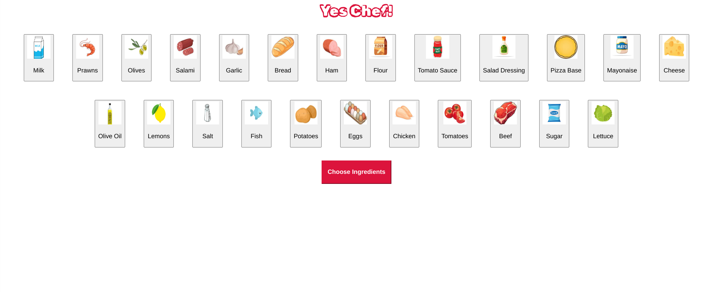

# yes-chef-pm2 written with Markdown 
# Contents 
## UX
  ### Project Goals: 
   Yes Chef! is a fun learning-based memory game that is aimed towards staff working in a kitchen/ resturant helping them learn new recipes and what ingredients go in them in a fun and interactive way.
  
  ### Player Goals:
   The target audience for this game is primarily for staff members in a resturant/ kitchen. It can also be for anyone who wants to be entertained anmd see if they have what it takes to work in a kitchen.
    * A fun memory game 
    * Different levels for players to work through that increase in diffioculty as they progress
    * Easily identifiable ingredients with images, text and alternatitve text to represent each ingredient item, to 
     make Yes Chef! accessible
    * Responsive fridge section to store ingredients 
    * Feedback to wether the player has selected the right ingredients for the recipe card that they chose
   This game meets player needs by helping them to learn the ingredients for each recipe that is served at the resturant that they work at. Knowing what ingredients are needed for each recipe will thelp the staff to do their job more efficiently. 

  ### Developer and Business goals 
   * To develop a simple mamory game that helps staff to learn the ingredients of dishes- making it eaier to   
    introduce a new menu and recipes in a fun and engaging way
   * Game to be styled in resturants brand colours and logo to reinforce to players that this game is associated with 
    the resurant 
   * To create a project to build a portfolio and practice using java script, html and css

## User Stories
  As a player of the game that is working for the resturant
  -As an employee that works in the kitchen I want to be able to learn ehat ingredients go in the new recipes in a fun way
  -As an employee that works in the kitchen I want to be able to select a recipe card of a new dish, so I can practice memorising the ingredients for it 
  -As an employee that works in the kitchen I want to have a time limit to view the ingredients listed on the recipe card, so i can test my memory
  -As an employee that works in the kitchen I want to recive immediate feedback on the accuracy of my selections, so I can learn the ones that I get wrong 
  -As an employee that works in the kitchen I want to be able to recognise that this game is associated with my job 
  -As an employee that works in the kitchen I want to be able to access the game conveniently so I can practice whenever I have spare time 

  As an owner/ head chef of the resturant 
   -to have a game that can be easily updated with new recipes when required

## Design Choices 
 The game uses the same colour pallete and logo as the resturant that it was created for to maintain brand consitency. It also aids in reminding players that though this is a game meant to be enjoyed, it is also relevent to their job and therefore should pay slight attention. All the following styling choices were chosen as they are cohesive with the resturants brand image: 
 Fonts
 Icons
 Colours
 Backgrounds: All game pages have a matching blank white background as a design choice, to keep players foucus on the ingredient items and their icons stand out better against plain white.

## Wireframes
 
 
 

## Bugs Discovered 
 1. Table of images not staying in a horizontal grid layout in fridge.html
  * All ingredinet would shift around the page every time they were attmepted to be styled using css properties 
  * Using the flexbox layout provided an efficient way to arrange elements within a container

## Credits
  ### Code
borderd table- https://getbootstrap.com/docs/4.1/content/tables/
<table class="table table-bordered">
  <thead>
    <tr>
      <th scope="col">#</th>
      <th scope="col">First</th>
      <th scope="col">Last</th>
      <th scope="col">Handle</th>
    </tr>
  </thead>
  <tbody>
    <tr>
      <th scope="row">1</th>
      <td>Mark</td>
      <td>Otto</td>
      <td>@mdo</td>
    </tr>
    <tr>
      <th scope="row">2</th>
      <td>Jacob</td>
      <td>Thornton</td>
      <td>@fat</td>
    </tr>
    <tr>
      <th scope="row">3</th>
      <td colspan="2">Larry the Bird</td>
      <td>@twitter</td>
    </tr>
  </tbody>
</table>

game difficulty star rating inspired by code produced by https://www.geeksforgeeks.org/star-rating-using-html-css-and-javascript/
star icon copied from this too

  ### Media
All ingredients images fetched from 
https://www.shutterstock.com/discover/image-packs-0224?cr=ec&ds_ag=FF%3DBrand-Shutterstock_Exact_AU%3DProspecting&ds_agid=58700001307463988&ds_cid=71700000014796324&ds_eid=700000001391652&gad_source=1&gclid=CjwKCAiA1eO7BhATEiwAm0Ee-Ai7OlJmnFRhBASWqzSBPnUI45MarFeDGVdDVvZ7mtNOxcEI36ZsfhoC8jkQAvD_BwE&gclsrc=aw.ds&kw=shutterstock&pl=PPC_GOO_UK_BD-725857150544&

utm_campaign=CO%3DUK_LG%3DEN_BU%3DIMG_AD%3DBRAND_TS%3Dlggeneric_RG%3DEUAF_AB%3DACQ_CH%3DSEM_OG%3DCONV_PB%3DGoogle&utm_medium=cpc&utm_source=GOOGLE and https://www.istockphoto.com/

Favicon fetched from https://www.favicon.cc/

## Deployment
 * Install code steps:
 1. Install Git
    Download and install Git from the official Git website (https://git-scm.com/).
 2. Clone the Repository
    Open a Terminal and navigate to the directory and clone repo URl
 3. Run the Project via the terminal by typing command python3 -m http.server

 * Run code steps:
  1. Either install the code to your device or clone it following the above steps
  2. There are no necissairy dependancies to install for Yes Chef!
  3. To run the game follow this link: https://legendary-yodel-7vpvq4w666pxfg65-8000.app.github.dev/ 

 * Clone code steps:
  1. Have git installed to your computer 
  2. Go to the git repository and select the clone button
  3. Copy the clone command link
  4. From a terminal window, change to the local directory where you want to clone your repository
  5. Paste the clone command link into the terminal and press Enter.

## Testing
 ### HTML code validated using: https://validator.w3.org/
 
 
 
 
 
 

 ### CSS code validated using: https://jigsaw.w3.org/css-validator/
 
 
 

 ### Java Script code validated using: https://codebeautify.org/jsvalidate
 

 ### How the game meets the identified needs and wants found in the user stories :

 * As a player of the game that is working for the resturant
   -As an employee that works in the kitchen I want to be able to learn ehat ingredients go in the new recipes in a fun way
    i. all new recipes are uploaded with a difficulty rating
    ii. players can test themselves repeatedly and have as many goes as needed by clicking play again when their current game has ended
   
   -As an employee that works in the kitchen I want to be able to select a recipe card of a new dish, so I can practice memorising the ingredients for it 
    i. make recipe cards large and clickable with names and difficulty ratings in a clear and simple layout
   
   -As an employee that works in the kitchen I want to have a time limit to view the ingredients listed on the recipe card, so i can test my memory
    i. timer for 5 seconds counts down as soon as player clikcs on recipe card
    ii. styled the timer to show number of seconds left in game to keep player aware of the time left 

   -As an employee that works in the kitchen I want to recive immediate feedback on the accuracy of my selections, so I can learn the ones that I get wrong 
    i.when player clicks the submit button with their selected ingredients, a notification will pop up saying that they either chose the right ingredients or wrong ingredients 

   -As an employee that works in the kitchen I want to be able to recognise that this game is associated with my job
    i. keep the brand image consistent by using the same colour plalete and logos as the resturant business that the game was specifically designed for  

   -As an employee that works in the kitchen I want to be able to access the game conveniently so I can practice whenever I have spare time 
    i. Yes Chef! is availible to load in a web-browser via a link that their employer can share over message or email

 * As an owner/ head chef of the resturant 
   -to have a game that can be easily updated with new recipes when required
    i. developed through git for version control and code written in a GitHub repository that stores and saves code whilst also allowing it to be modified and shared with anyone that has access to the link
    ii. code kept in a simple structure to ensure simplicity of adding new recipe cards 

     #### Steps to add a new recipe card:
      1. make note of recipe name and all ingredients that it calls for
      2. create a new file and name it insert_recipe_name-rc.html 
      3. copy all code from prawn-rc.html and paste into the new file
      4. change all words matching 'prawn' to the new recipe name (headings)
      5. change all ingredients from 'olive oil' and 'prawns' to the ingredients for the new recipe
      6. replace all prawn images and alt text to match new ingredients
      7. modify the difficulty level of new recipe card to match the amount of ingredients in recipe (more stars = increased difficulty)
      8. in index.html, copy and paste a new div for the recipe card and modify content to match new recipe
      9. in script.js create a new recipe object for the new recipe 
      10. add new recipe object to the recipe card data array
      11. add new ingredients to the ingredient data array
      12. update recipe card logic for what ingredients are true and what are false 

 ### Final game screenshots 
 
 
 
 
 
 
 
 
 

 ### Testing table 
 Expected - Game is expected to show user a selection of menus they should choose from when the home page is first loaded
 Tested   - Tested the game by loading the home page
 Result   - Game acted as expected and presented me with recipe cards to select

 Expected - Game is expected to take me to an ingredient list when a recipe card is selected 
 Tested   - Tested the game by selecting a recipe card
 Result   - Game acted as expected and took me to the recipe card page displaying a lost of ingredients 

 Expected - Game is expected to start a 5 second timer when recipe card is clicked 
 Tested   - Tested the game by clicking on a recipe card
 Result   - Game acted as expected and started the timer when loaded

 Expected - Game is expected to automatically take player to the fridge page when timer is up
 Tested   - Tested the game by letting the timer run out on the recipe card page
 Result   - Game acted as expected and automatically took user to fridge page

 Expected - Game is expected to show player what ingredient items they have selected in the fridge by showing a green border when item is clicked 
 Tested   - Tested the game by clicking multiple ingredient items
 Result   - Game acted as expected and a green border appears when ingredient item has been selected

 Expected - Game is expected to tell player wether they have selected the correct ingredients based on the recipe card they previously chose
 Tested   - Tested the game by chosing the correct items for the recipe card selected and submitting them
 Result   - Game acted as expected and produced a congratulations pop up message letting the player know they were correct 
 Expected - Game is expected to tell player wether they have selected the correct ingredients based on the recipe card they previously chose

 Tested   - Tested the game by chosing the wrong items for the recipe card selected and submitting them
 Expected - Gme will alert user that they missed some ingredients
 Result   - Game acted as expected and produced a try again pop up message letting the player know they were wrong